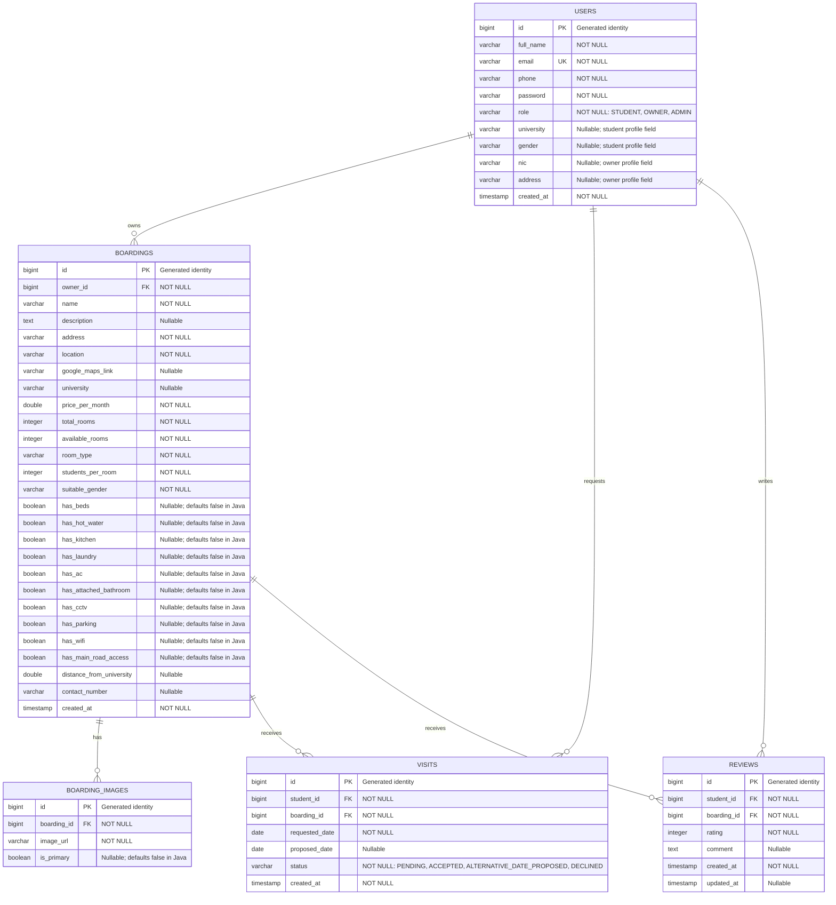

# UniStay Database ER Diagram

This diagram documents the database tables mapped by the backend JPA entities.
It includes persisted columns, primary and foreign keys, and the relationships
defined by the entity mappings.

## Relationship and attribute notes

- `USERS` stores students, boarding owners, and admins in one table. The
  `role` column distinguishes these account types; student and owner profile
  columns are nullable because they are role-specific.
- Each boarding belongs to one owner (`boardings.owner_id`).
- Each boarding can have zero or more images, visits, and reviews. Each image,
  visit, and review references exactly one boarding.
- A visit and a review reference a user through `student_id`. The foreign key
  itself does not constrain that user's `role`; student-only behavior is
  enforced by the application.
- `UK` marks the unique email constraint. `PK` and `FK` mark primary and
  foreign keys. Enum values are persisted as strings.
- Types and nullability are derived from the JPA entity mappings and default
  naming/type conventions. Verify against the deployed database if its schema
  has been changed independently.
